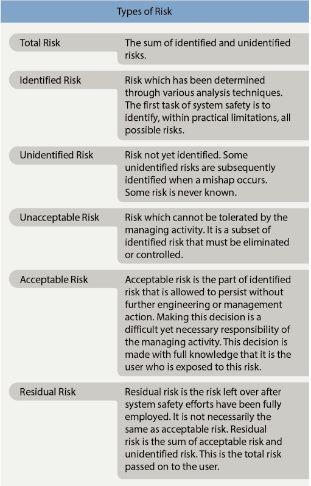

# Chapter 1: Risk Management and Single-Pilot Resource Management

## Defining Risk and other Key Concepts
- **Risk**: The _probability_ and possible _severity_ of accident or loss from _exposure to various hazards_, including injury to people and loss of resources. Specifically it is _the future impact of a hazard that is not controlled or eliminated. It is the possibility of loss or injury. The level of risk is measured by the number of people and resources affected (exposure); the extent of possible loss (severity); and likelihood of loss (probability)_.
- **Risk Management**: A formalized way of logically weighing the potential const of risks against the possible benefits of allowing those risks to stand uncontrolled. Specifically it is _a decision making process designed to identify hazards systematically, assess the degree of risk, and determine the best course of action._
- **Hazard**: A present condition, event, object, or circumstance that could lead to or contribute to an unplanned or undesired event, such as an accident. It is the source of danager. For example, a nick in the propeller represents a hazard. 
- **Safety**: Freedom from those conditions that can cause death, injury, occupational illness, or damage to or loss of equipment or property, or damage to the environment. Note that absolute safety is not possible because complete freedom from all hazardous conditions is not possible. Therefore, safety is a relative term that implies a level of risk that is both perceived and accepted. 

## Types of Risk
- **Total Risk**: The sum of identified and unidentified risks
- **Identified Risk**: Risk which has been determined through various analysis techniques. The first task of system safety is to identify, within practical limitations, all possible risks. 
- **Unidentified Risk**: Risk not yet identified. Some unidentified risks are subsequently identified when a mishap occurs. Some risks are never known.
- **Unacceptable Risk**: Risk which cannot be tolerated by the managing activity. It is a subset of identified risk that must be eliminated or controlled.
- **Acceptable Risk**: Acceptable risk is the part of identified risk that is allowed to persist without further engineering or management action. Making this decision is a difficult yet necessary responsibility of the managing activity. The decision is made with full knowledge that it is the user who is exposed to this risk. 
- **Residual Risk**: Residual risk is the risk left over after system safety efforts have been fully employed. It is not necessarily the same as acceptable risk. Residual risk is the sum of acceptable risk and unidentified risk. This is the total risk passed on to the user.

## Principles of Risk Management
- _The goal of risk management is to proactively identify safety-related hazards and mitigate the associated risks._ 
- When a pilot follows good decision-making practices, the inherent risk in a flight is reduced or even eliminated. Four principles of Risk Management are:
#### Accept No Unnecessary Risk
- _Unecessary risk is that which carries no commensurate return in terms of benefits or opportunities_. Of course you will have to accept _some necessary_ risk to be able to fly a plane. But never make a flight where there is unecessary risk with no return value. If you've just received a new plane you aren't familiar with, flying it into low IFR conditions would be an unnecessary risk. 
#### Make Risk Decisions at the Appropriate Level
- Risk decisions **should only be made by the person who can develop and implement risk controls**. Especially in a single pilot situation, the pilot makes the decision to accept certain levels of risk, _**so why let anyone else -- such as ATC or your passengers -- make risk decisions for you (the pilot)?**_ 
#### Accept Risk When Benefits Outweight the Costs
- All identified benefits should be compared agains all identified costs. Even high-risk endeavors may be undertaken when there is clear knowledge that the sum of the benefits exceeds the sum of the costs. Bringing back the arrival of the brand new airplane from 'accept no unnecessary risk example', a clear, calm day with exquisite weather forecasted would be a good time to fly that airplane for the first (couple of) times instead of Low IFR. 
#### Integrate Risk Management into Planning at All Levels
- Risks are more easily assessed and managed in the early planning stages of a flight. Changes made later in the process of planning and execution may become more difficult, time consuming and expensive. However you should still incorporate it at all levels any time risk management takes place. 

## Process of Risk Management
- Risk management is a simple process which identifies operational hazards and takes reasonable measures to reduce risk to personnel, equipment, and the mission. A recurrent process that needs to _**identify the risk, assess the degree of risk, and determine the best course of action to mitigate the risk.**_

### Step 1 - Identify the Hazard(s)
- A hazard is any real or potential condition that can cause degredation or disaster. _Experience, commmon sense, and specific analytical tools help identify risks. Once the pilot determines that a hazard poses a potential risk to the flight, it may be further analyzed.
### Step 2 - Assess the Risk
- Each identified risk may be assessed in terms of its likelihood (probability) and its severity (consequences) that could result from the hazards based upon the exposure of humans or equipment to those hazards. An assessment is then available, usually by means of risk assessment matrix, such as an online Flight Risk Awareness Tool (FRAT). _This process defines the probability and severity of an accident_.
### Step 3 - Mitigate the Risk
- Investigate specific strategies and tools that reduce, mitigate or eliminate the risk. 

## Identifying Risk
Hazards and their associated risks can either be obvious or harder to detect. You should methodically identify and classify risks to a proposed or ongoing flight by maintaining constant situational awareness. To assist this process, it is helpful to apply the simple acronym [PAVE](../../PHAK/CH2-ADM/PAVE.md) to your risk management process. The acronym stands for Pilot, Aircraft, Environment, External pressures. Use the following guidelines and questions to identify risk using the PAVE acronym.

- **Pilot In Command (P)**: _Do I have the right qualifications to make this flight? Am I Part 61 satisfied? (recency, biennial, etc)_. 
    - This is where you integrate your **IMSAFE** checklist for the pilot's readiness to fly and potential risk factors related to the pilot themselves.
        - *I*: Illness
        - *M*: Medication
        - *S*: Stress (Acute or Chronic)
        - *A*: Alcohol (8hrs bottle to throttle, max 0.4% BAC)
        - *F*: Fatigue (Acute or Chronic)
        - *E*: Emotional factors
- **Aircraft (A)**: _Is the aircraft the right one for the flight? Is it loaded within allowable CG and Max Gross Weight? What is the maintenance status? Does it have the power required? Is it current on inspections?_
- **EnVironment (V)**: _Weather, Weather, Weather! This is the main killer of pilots either directly or indirectly. Are you instrument rated? What is the forecast for both destination and departure? Are you making a return leg later (what is the weather for that)? This also includes the Airports at departure and arrival: Are the runways long enough, what is the surface elevation (combine with weather to find Density Altitude), Are there any NOTAMS for the airports or vicinity airspace?_
- **External Factors (E)**: _Are your passengers going to be a problem? Are you under pressure to get to a destination for some pressing external reason? Is there a financial stake in making the flight or a financial penalty for not making it?_ 

## Relating ADM/SRM to Student Learners
- We want the student to understand all processes of risk management, so relate the **PAVE** checklist with actual situations and scenarios. 