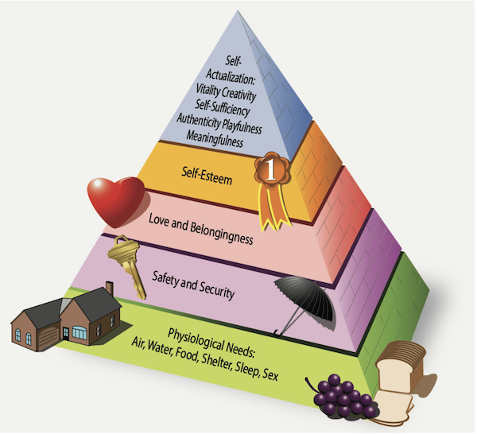

### Understanding Human Behavior 
1) Essential to grasping patterns behind human actions and decision making.
    - Human behavior is the product of factors that cause people to _act_ in predictable ways.
    - Behavior is influenced by _factors_ and componsed of _elements_
    - Elements include:
        - **Innate Human Nature**: Biological and Psychological predisposition
        - **Individual Experience**: Personal history and learned behaviors. Cognitive development.
        - **Environment**: Immediate surroundings and external stimuli. Social, cultural and economic influences.

2) Definitions of human behavior often involve attempts to _satisfy certain **needs**_ 
    - **Needs** may be:
        - Simple: Food, water, etc.
        - Complex: Respect, acceptance, ego-stoking
    - Human behavior is characterized by a distinct set of physical, physiological, and behavioral features.
        - Thoughts, feelings and behavior can differ radically, especially relating to age.
        - As a learner develops, that development and maturity drives the mode of action from _dependency_ to _self-direction_. Necessarily an instructor needs to offer a curriculum and environmnent that addresses the varying learner tendency to _self-direct_.
    - **Continued effort at understanding human behavior leads to succesful instruction**

3) Instructor and learner relationship integrity requires a working understanding of learner personality types
    - Insight into the individual and their unique learning style can enhance educational outcomes.
    - However there is variation in human behavior due to basic dfferences in the ways individuals prefer to use their _perception_ and _judgement_.
    - Personality type also plays a key role in how a person learns or teaches.
    - Compatibility between teaching and learning promotes:
        - Information retention
        - Effective application
        - Extensive learning
        - Positive attitude
    - Important for instructors to when necessary adapt teaching style to bridge the difference (if exists) and better match a learning style.

4) **Motivation** drives actions and behaviors, serving as the foundation for achieving goals.
    - Motivation is the _primary_ driver of a learner's progress and ability to learn. 
    - Slumps in learning are often due to declining motivation.
    - Motivations may be:
        - **Positive or Negative**
        - **Tangible or Intangible**
        - **Obvioius or Subtle and Difficult to identify**
    - **Positive Motivation**: is _essential_ to true learning, is provided by the promise or achievement of rewards, and is generally the more effective way to properly motivate learners. 
        - Such rewards may involve financial gain, satisfaction of the self-concept, personal gain, or public recognition.
        - Tangible positive motivation may include rewards that involve financial gain or public recognitio.
        - Intangible positive motivations may include the desire for personal comfort and security, group approval, and achievement of a favorable self-image.
    - **Negative Motivation**: Are those that cause a learner to react with fear and anxiety.
        - _Negative motivations in the form of criticism and threats should be avoided with all but the most overconfident and impulsive of learners_.
    - **Tangible Motivation**: Often comes in form of financial or physical rewards.
    - Learners seeking **intangible rewards** are motivated by the desire for personal comfort and security, group approval, etc. Instructors often forget this form of motivation.
    - Sources of motivation vary, _but what's important is for the instructor to to make the learner aware that a particular lesson can help with reaching an important goal_.
        - **If learners are unable to see the benefits or purpose of a lesson, they are less motivated**.
        - **Confusion, disinterest, and uneasiness on the part of the learner could happen as _a result of not knowing the objective of each period of instruction_**.
        - **If motivation is to be effective, learners must believe that their efforts will be suitably rewarded in a definite, tangible manner**
    - **Understanding where a learner’s motivation comes from may aid in maintaining motivation at the highest level possible**.
    - **To maintain motivation, an instructor must reward success by frequently presenting positive feedback**.
    - Learner anxiety can be minimized throughout training by emphasizing the benefits and pleasurable experiences that can be derived from flying, rather than continuously citing the unhappy consequences of faulty performances. 
    - Drops in motivation are common and can be overcome by reminding learners of their own goals and reassuring them their will be results for their efforts.

5) Human needs drive personal growth and development and can be organized into a series of levels.
    - Maslow's 'Pyramid of Human Needs'
        - Physical needs must be satisfied before so-called 'higher' needs can be used as motivators.
        - Maslow suggests that needs must be satisfied in ascending order.
    - Multiple psychological studies have since shown that
        - Lower needs do not have to be _completely_ fulfilled before people are able to achieve higher needs.
        - What matters is that parts of each level have been met, which allows the learner to focus on instructions given.
        - The order in which they are met does not matter, **however instructors should verify that most of the learner's needs have been met (law of readiness) and then focus the learners perception on the lesson**.
    - **Physiological Needs / Biological Needs**:
        - They consist of the need for air, food, water, and maintenance of the human body.
        - Unless the biological needs are met, a person cannot concentrate fully on learning, self-expression, or any other tasks.
        - _**Instructors should monitor their learners to make sure that their basic physical needs have been met. A hungry or tired learner may not be able to perform as expected**_.
    - **Safety and Security Needs**: Become essential after the basic biological needs are met.
        - Security needs are about keeping one's self from harm.
        - _**The aviation instructor who stresses flight safety during training mitigates feelings of insecurity and personal harm**_.
    - **Love and Belonging Needs**: Are social needs that people pursue to overcome feelings of loneliness and alienation.
        - Aviation learners are usually out of their normal surroundings during training, and their need for association and belonging is more pronounced.
        - _**Instructors should make every effrort to help new learners feel at ease and to reinforce their decision to pursue a career or hobby in aviation**_.
    - **Esteem Needs**: are about feeling good about one's self.
        - Humans have a need for stable, firmly based, high level of self-respect and respect from others.
        - Humans get esteem in two ways: **Internally** or **Externally**.
            - Internally, a person judges themselves worthy by personally defined standards. High self-esteem results in self-confidence, independence, achievement, competence, and knowledge.
            - Most people however seek external esteem through social approval and esteem from other people, judging themselves by what others think of them. External self-esteem relates to one's reputation, such as status, recognition, appreciation, and respect of associates.
        - When esteem needs are satisfied, a person feels self-confident and valuable as a person in the world.
            - When these needs are frustrated, the person feels inferior, weak, helpless, and worthless.
            - Esteem needs not only have a strong influence on the learner-instructor relationship _**but also may be the main reason for a learner's interest in aviation training**_.  
    - **Cognitive / Aesthetic Needs**: Include the _need_ to know and understand and the emotional result of achievement.
        - Humans have a deep need to understand what is going on around them. If a person understands what is going on, they can attempt to control it or make informed decisions about it.
        - _**The brain reinforces this need by giving a dopamine rush whenever something is learned**_. This is why the 'lightbulb' or 'eureka!' moments are **so** powerful for knowledge retention and profound understanding. 
        - Aesthetic needs (e.g. how well something is liked) can factor into the learner-instructor relationship. If an instructor does not 'like' a learner, this subtle feeling may affect the instructor's ability to teach that learner _(I'd argue this would be a **massive** barrier to effective teaching for a whole slew of cascading reasons)_
    - **Self-Actualization Needs**: include a person's need to be and do what the person was 'born to do."
        - These needs are only triggered when all the underlying needs are met.
        - Self-actualized people realize their potential, seek to develop themselves further, and think creatively. 
        - Self-actualized people are characterized by:
            - Being problem-focusd
            - Incorporating an ongoing freshness of appreciation of life
            - A concern about personal growth
            - The ability to have peak experiences
        - Helping a learner achieve their individual potential in aviation training offers the greatest challenge as well as the greatest reward to the instructor.

6) _**Defense mechanisms** are behavior patterns in which subconscious defenses are set against the reality of unpleasant situations_. 
    - People use these defenses to **soften the feelings of failure**, **alleviate feelings of guilt**, and **protect feelings of personal worth and adequacy**. 
    - Although defense mechanisms can serve a useful purpose, **they can involve some degree of self-deception and distortion of reality**. They alleviate symptoms, and not the causes.
    - Common defense mechanisms:
        - **Repression**: _**Placing uncomfortable thoughts into inaccessible areas of the unconscious mind**_. For example, a learner may have repressed fear of flying that inhibits their ability to learn how to fly.
            - Things a person is unable to cope with at present are pushed away to be dealt with at another time, or hopefully never dealt with b/c they faded away on their own accord
            - The level of repression can vary from temporarily forgetting an uncomfortable thougt to full amnesia where the events that triggered the anxiety are deeply burried.
        - **Denial**: _**Refusal to accept external reality because it is too threatening. It is the refusal to acknowledge what has happened, is happening, or will happen**_.
            - Denial is a form of repression which stressful thoughts are banned from memory. Related to denial is minimization where a person minimizes something that they've otherwise accepted.
        - **Compensation**: _**Process of psychologically counterbalancing perceived weakness by emphasizing strength in other areas**_.
            - Learners often attempt to disguise the presence of a weak or undesirable quality by emphasizing a more positive one.
            - Involves substituting success in a realm of life other than the realm in which the person suffers a weakness.
        - **Projection**: _**Placing one's own unacceptable impulses onto someone else. A person relegates the blame for personal shortcomings, mistakes, and transgressions to others**_
            - A learner pilot who fails a flight exam says 'I failed because I had a poor examiner' believes the failure was not due to their lack of personal skill or knowledge.
            - This learner projects blame onto an 'unfair' examiner or inadequate instruction by their instructor.
        - **Rationalization**: _**When a person cannot accept the real reasons for their own behavior**_. This permits the substitution of excuses for reasons. A subconscious technique for justifying actions that otherwise would be unacceptable.
        - **Reaction Formation**: _**Faking a belief opposite to one's true belief because the true belief causes anxiety**_. The person feels an urge to do or say something and then actually does or says something that is the opposite of what they really want.
        - **Fantasy**: _**When a learner engages in daydreams about how things should be rather than doing anything about how things are**_.
            - Provides a simple and satisfying escape from problems, but if learner gets sufficient satisfaction from daydreaming, they may stop trying to achieve other goals altogether: 
                - Lost in the fantasy the learner spends more time daydreaming about being a successful pilot than working toward the goal.
                - When carried to extremes, the worlds of fantasy and reality can become so confused that the dreamer cannot distinguish one from the other.
        - **Displacement**: _**Results in an unconscious shift of emotion, affect, or desire from the original object to a more acceptable, less threatening substitute**_.
            - Displacement avoids the risk associated with feeling unpleasant emotions and puts them somewhere other than where they belong, similar to repression.

