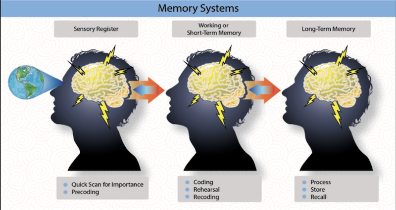

## Memory

1) At it's core, **memory serves as the bridge between a learner's ability to retain information and the higher cognitive process of effectively applying** what has been learned. 
    - Memory is an integral part of the learning process. It includes three parts: the **sensory register**, the **short-term (or working) memory**, and the **long-term memory**

2) **Sensory memory is the component of the memory system that captures, filters, and processes stimuli**
    - The **sensory register** receives initial input from the environment and quickly _processes it according to the individual's preconceived concept of what is important_, a process on the subconscious level.
    - **Precoding** is the selective process by which the sensory register _recognizes certain stimuli and immediately transmits them to the working memory for action_ Irrelevant stimuli are also discarded by the sensory register.
3) The **short-term memory (STM)**, or _working memory_, is the receptacle of the information deemed important by the _sensory register_.
    - A key limitation of STM is that _it takes 5-10 seconds to properly code information_. If the coding process is interrupted, that information is easily lost because it is stored for only 30 seconds. **The purpose of STM is to put information to immediate use**.
    - The information may temporarily remain in the short-term memory, or it may rapidly fade. Retention of information by the short-term memory is aided when the information is initially categorized into systematic chunks in a process known as **coding**. Retention is also aided by repetition or rehearsal of the information [(rote learning)](./2.6-Domains-of-Learning.md#rote-learning)
    - Information remains in the short-term memory for longer periods when it can be related to an individual's previous knowledge or experiences through a process known as **recoding**
        - **Recoding** may be described as a process of relating incoming information to concepts or knowledge already in memory. 
        - Methods of recoding vary with the subject matter, but they typically involve some type of association, such as mnemonics. **Mnemonics** include acronyms, acrostics, rhymes, and chants. A mnemonic uses a pattern of letters, ideas, images, or associations to assist in remembering the information. **The use of associations such as rhymes and mnemonics is best suited to the short-term memory**.
    - Short-term memory is the part of the memory system _where information is stored for roughly 30 seconds, after which it may rapidly fade or be consolidated into long-term memory, depending on the individual's priorities._
    - Several common steps help retention in short-term memory. These include rehearsal or repetition of the information and sorting or categorization into systematic chunks. 
        - The short-term memory is not only time limited; it also has **limited capacity**, usually about **seven bits or chunks of information at a time**. A seven-digit telephone number is an example.
    - The ability to retrieve knowledge or skills from memory is primarily related to two things: (1) _how often that knowledge has been used_ in the past and (2) _how recently the knowledge has been used_. These two factors are called _frequency and recency of use_. Frequency and recency can be present individually or in combination

4) The **long-term memory (LTM)** is where information is stored for future use.
    - For the stored information to be useful, some special effort must have been expended during the recoding process.
    - It should be noted that the long-term memory is a reconstruction, not a pure recall of information or events.

5) How usage affects memory is muscle-like-frequent use strengthens retrieval, while neglect weakens it over time.
    - Knowledge or skill retrieval from memory is primarily related to two different 'use' types:
        - **Frequency**: How often that knowledge has been used in the past
        - **Recency**: How recently the knowledge has been used. 

    - **Usage**: 
        - Both frequency and recency 
            - Any knowledge that has been frequently used in the past and continues to be used in the present benefits from both frequency and recency, ideally making retrieval quick and easy. 
        - Frequency only: 
            - Knowledge or skill that has been used much in the past but has not been used recently is vulnerable to being forgotten. That knowledge or skill is likely to be retrieved slowly, if at all, and will require recent rehearsal or practice to refresh the memory and retrieve it for application.
        - Recency only:
            - Knowledge or skill that has been recently used but has not been used in the past is knowledge that has been recently acquired. It's vulnerable to being forgotten since there's little to distinguish it from 'throw away knowledge', and will require a program of regular rehearsal to build up its frequency to make it easily remember-able and applicable. 

6) **Forgetting** or _loss of memory_, occurs when memory retrieval fails.
    - Basic Theories of forgetting:
        - The <u>theory of retrieval failure</u> considers an individual's **inability to retrieve information. Retrieval failure may be the byproduct of _poor information encoding_ with the result that information isn't persisting in long-term memory**
        - The <u>theory of fading</u>  **states that a person forgets information that is not used for an extended period of time. Like when learners are saddened by the small amount of actual data retained several years after graduation**
        - The <u>theory of interference</u> suggests that people **forget something because a certain experience has overshadowed it or the learning of similar things have intervened**. Learners might have superseding events take place that displace prior knowledge and/or skill. Similar material tends to interfere more with memory than dissimilar material, and material not well learned initially more susceptible to interference 
        - The <u>theory of repression or suppression</u> states that **memories are pushed out of reach because the individual doesn't want to remember the feelings associated with them. Any and all susceptible to severe anxiety or panic in a plane could easily forget this way. 
            - **Repression** is an unconscious form of forgetting and is unintentional
            - **Suppression** is conscious and intentional
    - Responses that produce a pleasurable return are called **praise**
        - Praise stimulates remembering because responses that give a pleasurable return tend to be repeated.

