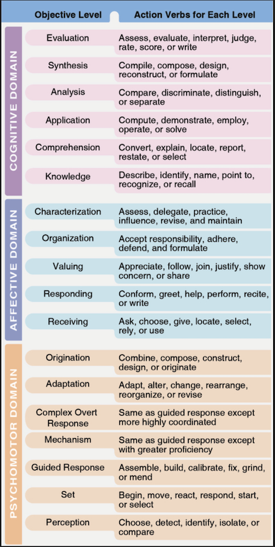
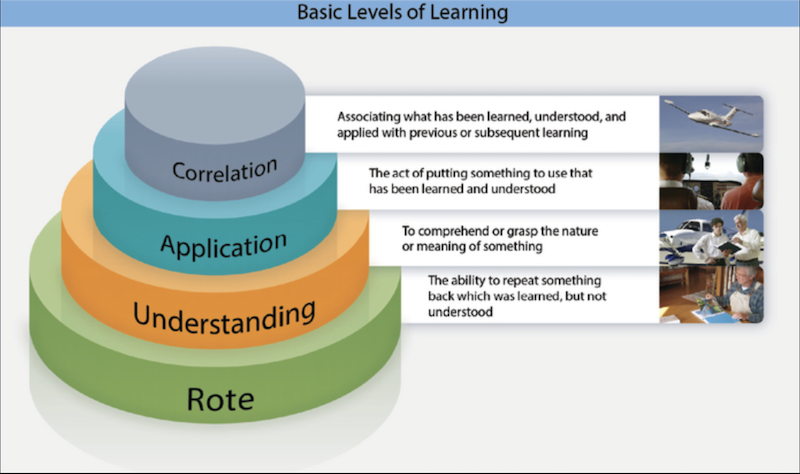

## Domains of Learning

1) There are 3 **domains of learning**
    - They determine the domain of learning involved at any one time: _skill_, _knowledge_, _attitude_.
        - Knowledge (thinking) is formally termed: The **Cognitive** domain.
        - Attitude (feeling) is formally termed: The **Affective** domain.
        - Skill (doing) is formally termed: The **Psychomotor** domain.
    - Each of the domains of learning has a hierarchy of educational objectives, often referred to as a _taxonomy_.
        - It sorts possible learning outcomes into the three domains of learning and ranks them in a developmental hierarchy from least complex to most complex.

2) The **Cognitive Domain (thinking)** deals with mental activity and knowledge (e.g. facts, concepts, or relationships).
    - **The three domains of learning determine what is being learned (knowledge, attitudes, or skills) while the _four levels_ of learning describe how deeply the learner engages with the material**
    - Learning may be accomplished at any of the four levels.
    - The **lowest** level is **rote learning**, which is the ability to just repeat back what has been taught, without necessarily understanding or being able to apply what has been learned.
        - EXAMPLE: Being able to cite the design maneuvering speed of an airplane.
        - Many learners use commercially-developed training materials to _memorize_ FAA testing concepts, which is another example of rote learning.
        - Because these prep materials emphasize rote learning, _instructors should stress that these materials are not designed as stand-alone learning tools, and should only be considered a supplement to instructor-led training_.
    - The next highest level, the **understanding level**, the learner not only can repeat what has been taught _but also comprehends the principles and theory behind the knowledge_.
        - EXAMPLE: Being able to explain how gross weight affects design maneuvering speed.
        - Being able to _explain_, not just recall or demonstrate, is understanding
    - At the **application level**, the learner not only understands the theory but also can **apply** what has been learned and perform in accordance with that knowledge.
        - The learner understands the procedure, has demonstrated it, and has practiced the procedure to a point that it can be performed with consistency. 
        - This is the level at which most instructors stop teaching.
    - At the **correlation level**, the learner is able to associate various learned elements _with other segments or blocks of learning or accomplishment_.
        - EXAMPLE: Knowing what to do if, during the flight a portion of the practical test, the examiner closes the throttle and announces "simulated engine failure".

3) The **affective domain (feeling)** relates to personal attitudes, beliefs, and values.
    - It emphasizes emotions, attitudes, and values in learning, with enthusiasm and motivation playing a crucial role in fostering engagement and understanding. 

4) The **Psychomotor Domain (doing)** concerns physical skills. These skills involve physical movement, coordination, and the use of motor skills.
    - While various examples of the psychomotor domain exist, the practical instructional levels for aviation training purposes include the following:
        - **Observation**
        - **Imitation**
        - **Practice**
        - **Habit**
    - Skills involving the psychomotor domain include
        - Learning to fly a precision instrument approach procedure _(we know this involves a lot of subtle and sometimes understated hand-eye coordination)_
        - Programming a GPS receiver 
        - Using sophisticated maintenance equipment.
    - As physical tasks and equipment become more complex, the requirement for integration of cognitive and physical skills increases.