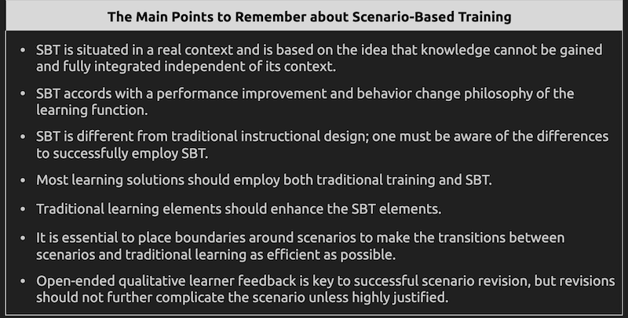

## Scenario Based Training (SBT)

1) With respect to the learning process, SBT immerses learners in realistic situations to build real-world adaptability, preparing learners for unpredictable scenarios.
    - These require problem-solving skills and exploring more realistic decision making.
        - SBT transforms instruction into **active**, **experience-driven** process, ensuring that learners do not just gain knowledge but develop _practical, adaptable expertise_.
    - Realistic scenarios engage emotions, which reinforces _risk management_, _professionalism_, and __*confidence*__ and leads to 
        - Strengthening decision making
            - Being able to better anticipate outcomes and make informed decisions 
        - Developing **judgement** rather than mechanically following rules.
            - Make _situationally appropriate_ decisions. 
    - SBT applies procedures as contextual challenges allowing for physical skill refinement.
        - Again encouraging _critical thinking_ rather than passive knowledge absorption
    - For SBT to be effective, it is vital that the instructor and learner establish the following information 
        - Flight scenario
            - **Scenario Destination**
            - **Desired Learning Outcomes**
            - **Desired Level of Learner Performance**
            - **Possible In-Flight Scenario Changes**
        - Non-flight scenario
            - **Narrative of Task Goal**
            - **Desired Learning Outcome**
            - **Desired Level of Learner Performance**
            - **Possible Scenario Changes**
    - **SBT teaches learners to assess situations and react appropriately**
        - Overall we want the learner to be ready to _exercise sound judgment_ and _make good decisions_. Instructors need to create lessons appropriate to the stage of learning, help them become _confident planners_, and help them _understand knowledge requirements_ present in _real-world applications_
