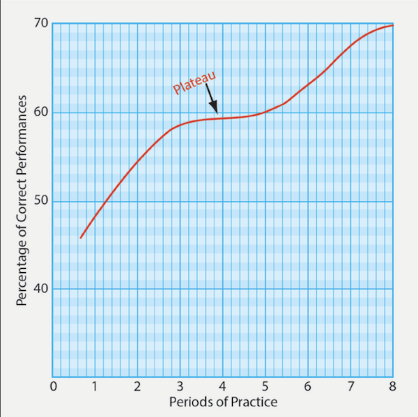

## Acquiring Skill Knowledge

1) **Skill knowledge** is reflected in motor or manual skills and in cognitive or mental skills present in the act of _doing something_
    - Unlike declarative knowledge, skill knowledge is often implicit. Learners may not be consciously aware of it or be able to articulate the skill in words. 
        - Ability is demonstrated through action 
        - Skill knowledge is acquired slowly through related experience.
        - _Evidence of skill knowledge is gained through observations of performance_, it's based on _extensive practice_ which leads to the _storage of skill knowledge_.

2) Stages in the development of any skill acquisition chart the development from beginner to expert. **Skill acquisition follows three characteristic stages: _cognitive_, _associative_, and _automatic_**. Instructors must learn to recognize these stages in learner performance in order to accurately asses their progress. 
    - The **cognitive stage** of learning has a **basis in factual knowledge**. Since the learner has no prior knowledge of flying, the instructor first introduces them to a basic skill. 
        - The learner memorizes the steps required to re-perform the skill. 
        - As the learner carries out these memorized steps, they are often unaware of progress or may fixate on one aspect of performance.
        - Performing the skill at this stage typically requires **all** of the learner's attention; distractions introduced by an instructor often cause performance to deteriorate or stop. A **distraction** is _an unexpected event that causes the learner's attention to be momentarily diverted_.
    - The **associative stage** of learning involves the **storage of a skill via practice**.
        - As practice continues, the learner learns to associate individual steps in performance with likely outcomes. 
        - The learner **no longer performs a series of memorized steps** but is able to assess their progress along the way and make adjustments in performance. 
        - Performing the skill still requires deliberate attention, but the learner is better able to deal with distractions. 
    - The **automatic response stage** of learning produces automaticity, which is one of the byproducts of continued practice. 
        - As procedures become automatic, less attention is required to carry them out, so it's possible to do other things simultaneously, or more comfortably.
        - By this stage, learner performance of the skill is rapid and smooth. The learner devotes much less _deliberate attention_ to performance and may be able to carry on a conversation or multitask while performing the skill.
        - The learner makes far fewer and/or smaller adjustments, during their performance.
        - The learner _may no longer be able to remember the individual steps in the procedure or explain how to perform the skill_
            - EXAMPLE: Learner who has reached the automatic response stage is a learner who can fly an ILS approach while simultaneously handling radio communications. 

3) **Knowledge of results** _(feedback)_ should be provided as soon after the performance as possible, and learners should not be allowed to practice mistages.
    - Simple skills
        - Learners often detect and correct their own mistakes with relative ease.
        - Errors are more apparent, making self-correction more straightforward.
    - Complex skills
        - Learners might sense something is wrong.
            - Mistakes can be less obvious, making identification more difficult.
            - Learners may struggle to pinpoint the issue or apply corrections effectively.
    - An instructor provides a critical function in making certain that the learners are aware of their progress.
        - **It is as important for learners to know when they are right as when they are wrong**. And it's more difficult to unlearn a mistake, and than learn the skill correctly than to learn correctly in the first place. 
        - Repeating a demonstration or example can show learners the standards their performance should ultimately meet. 

4) Learning how to develop skills is _rooted in automating that skill by repeating the action over and over_.
    - Evolving a skill from the cognitive stage _(often awkward and deliberate performance)_ through to the automatic response stage _(smooth and steady-handed performance)_ has one thing in common:
        - Progress appears to depend on repeated practice
    - This follows what is known as a **power law** of practice
        - This law states _that the speed of performance of a task improves as a power of the number of times that this task is performed_.

5) **Learning plateaus** define a _temporary stagnation in skill development when progress slows despite continued effort_.
    - The best way to prepare a learner to perform a task is to provide a clear, step-by-step example. Learners need a clear picture of what they are to do and how to do it.
    - Learning typically follows a trajectory commonly referred to as a **learning curve**
        - **The first part of the curve indicates rapid early improvement**.
        - **Then the curve levels off** This leveling off is known as the _plateau_.
    - Plateaus are a normal part of the learning process and instructors / learners should be prepared for them.
        - Keep in mind that the apparent lack of increasing proficiency does not necessarily mean that learning has ceased.
    - A learning plateau may signify any number of conditions. For example the learner may:
        - Have reached capability limits
        - Be consolidating levels of skill
        - Have lost interest
        - Need a more efficient method for increasing progress
    - _Instructors themselves can bring a method for increasing progress_
        - After repeating any task three or four times, give it a break to avoid causing a learning plateau.
    - The instructor should prepare the learner for the likelihood of learning plateaus during training _to avert discouragement_
    - Instructors can help learners who fall into learning plateaus by moving them to a different place in the curriculum and giving the plateaued task a break to revisit later.

        

