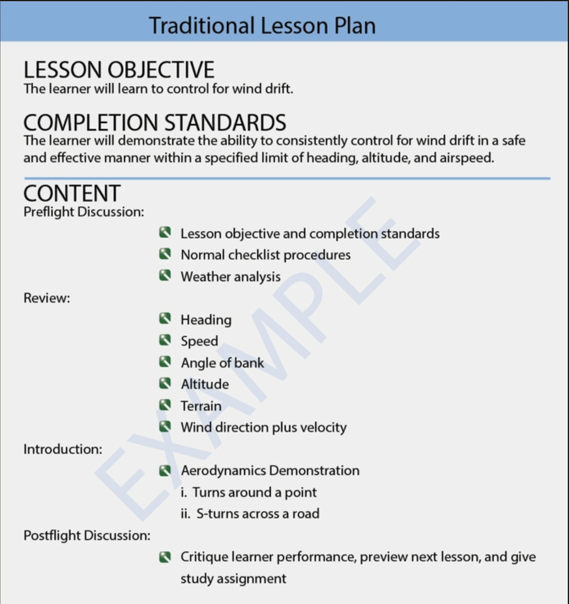
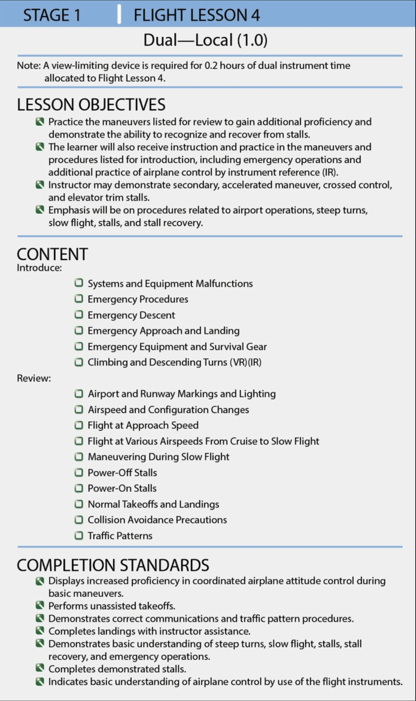
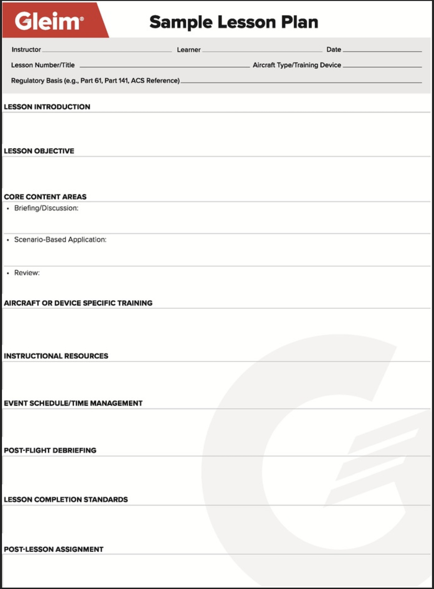

## Planning Instructional Activity

1) An instructor must plan instructional activity around a _structured series of lessons_ where each ground or flight event is a continuation of an integrated training process.
    - Each instructional activity requires the instructor plan the event provided for the learner to the same extent as the learner prepares for it. 

2) **Blocks of learning** follow along once the instructor establishes the overall training objectives
    - They must:
        - **Identify** the blocks of learning that **make up the necessary parts of the total objective**
        - **Ensure** that each block of learning identified is **truly an integral part of the overall objective**
            - Blocks of learning should represent **units of learning that can be _measured_ and _evaluated_**
            - Extraneous blocks of instruction are expensive frills, especially in flight instruction, and detract from the completion of the final objective
            - EXAMPLE: A learner is preparing for their first solo flight, and the instructor starts teaching about cross-country procedures _(extraneous)_
        - The blocks of learning **must be developed and arranged in their proper sequence**
            - In this way, **a learner can master the segments of the overall pilot performance requirements individually and can progressively combine these with other related segments until their sum meets the final objective**
        - Learners will master segments of blocks individually and can progressively combine these with other related segments until the overall training objectives are reached.
            - EXAMPLE: Flight training may be divided into the following major blocks: **1) Achievement of the knowledge and skills necessary for solo flight**, **2) Achievement of the knowledge and skills necessary for solo cross-country flight**, and **3) Achievement of the knowledge and skills appropriate for achieving a private pilot certificate**
        - Using this approach **provides the learner with a boost of self-confidence as each block is successfully completed** _(and not just appearing to aimlessly wander through ever complex material)_

3) A **training syllabus** is a practical guide to help instructors make sure that training is accomplished in a logical sequence, where all requirements are completed and properly documented. 
    - A training syllabus is an _abstract_ or _digest_ of the course of training. It consists of the blocks of learning to be completed in the most efficient order.
        - All syllabi **should stress well-defined objectives, content, and completion standards for each lesson**
        - The order of training can and _should be altered when necessary to suit the progress of the learner and the demands of special circumstances_, such as weather conditions
        - However it is often preferable to skip to a completely different part of the syllabus when the conduct of a scheduled lesson is impossible, rather than proceeding to the next lesson, which may be predicated completely on skills to be developed during the lesson being postponed.
        - EXAMPLE: If a learner is having a difficult time with normal approach and landings, it might be wise for the instructor to skip the next proposed lesson on short field landings and instead review another area of training. This would enable the learner to gain confidence and reinforce skills needed to perform normal landings.

4) **Lesson Plans** are organized outlines developed for a single instructional period. 
    - Each **lesson** of the **training syllabus** includes an **objective, content, and completion standards**
        - A properly constructed lesson plan will provide an outline that tells the instructor what to do, in what order to do it, and what teaching procedure to use.
            - The lesson plan **must be appropriate for the particular learner**. 
                - **Standard** lesson plans **may not be effective for learners requiring a different approach**
                - Therefore, the main concern in developing a lesson plan is the learner
            - A lesson plan should be prepared in writing for each instructional period **to show what specific knowledge and/or skills will be taught during a lesson**
                - A so-called "mental outline" is **not** a lesson plan
                - Another instructor should be able to take the lesson plan and know what to do in conducting the same period of instruction
            - Lesson plans are **designed to ensure that each learner receives the best possible instruction under existing circumstances**. Lesson plans _help instructors keep a constant check on their own activity, as well as that of learners_.
            - Steps to ensuring a quality lesson: 
                - **Determine the objective of the lesson**
                - **Instructor research**
                - **Determine the method of instruction**
                - **Identify the lesson planning format**
                - **Decide how to organize the lesson and supporting material**
                - **Assemble training aids**
                - **Write the lesson plan outline**
            - The following are some important characteristics of a well-planned lesson:
                - **Unity**: Each lesson is a unified segment of instruction
                - **Content**: The lesson should contain new material
                - **Scope**: The scope is balanced and reasonable
                - **Practicality**: The lesson is planned in terms of the conditions under which the training is conducted
                - **Flexibility**: Always allow for a degree of flexibility
                - **Relation to the course of training**: The lesson is planned and taught so that it relates to the course objectives clearly
                - **Instructional steps**: The lesson follows the steps of the teaching process
            - In flight training, **a brief review of earlier lessons is usually necessary**
            - **The teaching process organizes materials the instructor wishes to teach in a manner the learner can easily understand** Each lesson should also fall logically into the four steps of teaching process: **preparation**, **presentation**, **application**, and **assessment (review/evaluation)**
            - An adequate lesson plan, when properly developed should:
                - **Ensure a wise selection of material and the elimination of unimportant details**
                - **Make certain that due consideration is given to each part of the lesson**
                - **Aid the instructor in presenting the material in a suitable sequence for efficient learning**
                - **Provide an outline of the teaching procedure to be used**
                - **Serve as a means of relating the lesson to the objectives of the course of training**
                - **Give the inexperienced instructor confidence**
                - **Promote uniformity of instruction regardless of the instructor or the date on which the lesson plan is given**
            - Each lesson plan can contain a variety of items with an example of a traditional lesson plan below

            

            - The figure below is another example flight lesson plan

            

            - The **objectives** of each lesson, **content to support these objectives**, and **completion standards** _should be clearly stated_
                - The **objective is the reason for the lesson**: _what the learner is expected to know or be able to do at the end of the lesson_
                - Keeping the learner informed of lesson objectives and completion standards minimizes learner insecurity.
            - When planning time for learner performance, a **primary consideration is the length of the practice session**
                - A beginning learner reaches a _(saturation)_ point where additional practice is not only unproductive but may be harmful. As a learner gains experience, longer periods of practice become profitable.
                    - **Overlearning** is the continued study of a skill after initial proficiency has been achieved. Practice proceeds beyond the point at which the act can be performed with the required degree of excellence.
                    - **One common effect of overlearning is the development of automated routines rather than development of concept application**
                - As a learner gains experience, longer periods of practice are profitable
            - Lesson plans are designed to ensure each learner receives the best possible instruction under the existing conditions
                - **Understanding learning styles and approaches can help instructors make adjustments in how material is presented if their personal style differs from the particular way an individual learns**
            - The **VAK** model is **_based on the three main sensory receptors_**
                - **Visual style**: Use charts, graphs, and audio-visual tools
                - **Auditory style**: Have learners verbalize questions
                - **Kinesthetic style**: Use skill demonstrations

            - Blank Lesson plan to be used: 

            