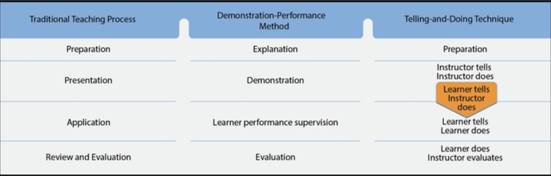

## Training Delivery Methods

1) The modern training environment offers a host of presentation opportunities.
    - Effective instructors utilize the following methods by which conveys the information in the most effective situation.

2) **Lecture** methodology involves an instructor addressing a group of learners, who typically engage as mostly _silent participants_.
    - The _lecture_ is used primarily for:
        - _Introducing learners to new subject material_
        - _Summarizing ideas_
        - _Showing relationships between theory and practice_
        - _Reemphasizing main points_
    - Four types of _lecture_ methods:
        - The **illustrated talk**: in which the speaker relies heavily on visual aids to convey their ideas to the listeners
        - The **briefing** which the speaker presents a concise array of facts to the listeners, who do not expect elaboration or supporting material
        - The **formal speech**: which the speaker's purpose is to inform, persuade, or entertain
        - The **teaching lecture**: which the instructor must plan and deliver an oral presentation in a manner that helps the learners reach the desired learning outcomes.
    - One _advantage_ of a _teaching lecture_ is that the instructor can present _many_ ideas in a relatively _short time_. Facts and ideas that have been logically organized can be concisely presented in rapid sequence. 
        - Thus, a teaching lecture is the most _economical_ of all teaching methods in terms of the time required to present a given amount of material. 
    - One _disadvantage_ of a teaching lecture is that the instructor does not receive a direct _reaction (either words or actions)_ from the learners. 
        - Thus, the instructor must develop a keen perception for subtle responses from the class and must be able to interpret the meaning of these indirect reactions and adjust lessons accordingly. These reactions could be in the form of _facial expressions_, _manner of taking notes_, and _apparent interest or lack thereof_ in the lesson.
        - The instructor must recognize that **the lecture method is _least useful for evaluating learner performance_**. A distinguishable characteristic of an **informal lecture** is active participation from the learner. Usually in the form of _the learner asking questions_
    - The following four steps should be followed in **preparing a lecture**:
        - _Establish the objective and desired outcome_
        - _Research the subject_
        - _Organize the material_
        - _Plan productive classroom activities_
    - The teaching lecture is best delivered extemporaneously but using a written outline
        - Because the exact words used to express an idea are chosen at the moment of delivery, the lecture can be personalized or suited to the moment more easily than one that is read or spoken from memory.
    - In the teaching lecture, use simple rather than complex words whenever possible.
        - Picturesque slang and colloquialisms, _if they suit the subject_, can add _variety and vividness_ to a teaching lecture.
        - Errors in grammar and use of vulgarisms _detract_ from an instructor's _dignity_ and reflect upon the intelligence of the learners.

3) **Discussion** methodology modifies the traditional lecture format by actively integrating the learner into the process _using a lecture first and **then discussion**_
    - The goal is learner participation and developing higher order thinking skills (HOTS).
        - It relies on a focused discussion with exchange of ideas and active engagement in discussing the lecture.
        - **Everyone** has the opportunity to comment, listen, think, and participate.
            - _Participation **improves information recall**_.

4) The **Guided Discussion**: methodology of teaching is the reverse of the lecture method. The instructor **uses questions to guide and stimulate discussion among learners**.
    - The instructor _does not present new ideas_
        - The instructor should treat everyone impartially, _encourage questions_, and _exercise patience and tact_.
    - In the guided discussion, _**learning is achieved through the skillful use of questions**_
        - _Questions_ facilitate _discussion_, which in turn _develops an understanding of the subject_.
    - Questions used in a **guided discussion** can be broken into _several types_, each with its usefulness in the guided discussion:
        - **Overhead** - The question is directed to the entire group to stimulate thought and response from each group member.
        - **Rhetorical** - The question stimulates thought, but the instructor will answer it themselves. This is normally used in a _lecture_, not a _guided discussion_.
        - **Direct** - The question is addressed to an individual for a response.
        - **Reverse** - The instructor answers a learner's question by redirecting the question for that learner to provide the answer.
        - **Relay** - The reverse question is addressed to the entire group, not the individual.
    - In **preparing questions**, the instructor should remember that the purpose is to bring about discussion, not merely to get answers.
        - Lead-off questions should be open-ended; i.e., they should start with _"how"_ or _"why"_
        - Avoid questions that begin with _"what"_, _"when"_, or _"does"_ because they only require short, categorical answers such as "yes" or "no".
    - Each question, in order to be effective, should
        - Have a specific purpose
        - Be clear in meaning
        - Contain a single idea
        - Stimulate thought
        - Require definite answers, and
        - Relate to previously taught information.
    - When it appears the learners have adequately discussed the ideas that support a particular part of the lesson, the instructor should _summarize what they've accomplished_
        - This _interim summary_ is one of the most effective tools available to the instructor.
            - This summary can be made immediately after the discussion of each learning outcome.
            - It consolidates what learners learned, emphasizes how much they know already, and points out any aspects they missed. 
        - _Unless the learners have some knowledge to exchange with each other, they cannot reach the desired learning outcomes_.
            - Learners without some background in a subject should not be asked to discuss that subject
        - _Having a guided discussion is similar to planning a lecture_. The instructor should:
            - Select an appropriate topic
            - State the lesson objective
            - Conduct adequate research on the topic.
            - Organize main and supporting points.
            - Plan at least one lead-off question. 
        - Instructors should prepare learners for a guided discussion. Learners should be encouraged to accept responsibility for contributing to the discussion.
        - Guiding a discussion can be classified into three parts: **introduction**, **discussion**, and **conclusion**
            - The **introduction** should include an _attention_ element, a _motivation_ element, and an _overview_ of key points.
            - Discussion should be stated with a lead-off question. Depending on how difficult the question is, the learners may need more time to think about the answer. The instructor should listen attentively and use "how" and "why" to follow up.
            - A guided discussion should be concluded by summarizing the material. 

5) **Cooperative** or **Group Learning**: Is an instructional strategy used to organize learners into small groups so that they can work together to maximize their own and each other's learning. 
    - The most significant characteristic of group learning is that it continually requires active participation of the learner.
        - The **main reason that learners are put in cooperative learning groups** is so they can individually **achieve greater success than if they were to study alone**
            - Learners in cooperative learning groups **tend to interact and achieve in ways and at levels that are rarely found with other instructional strategies**
        - Instructor planning is key to achieving meaningful learning
            - Instructors must _determine and outline clear lesson objectives and completion standards_. Evidence of mastery of targeted content and skills must be stated to inform learners of the intended results. 

6) **Demonstration-Performance** methodology is based on the principle that **we learn by doing**
    - It is **the most commonly used teaching method of flight instructors**
        - This is the ideal method for _teaching a skill that requires practice_, such as using a flight computer or performance crosswind landings.
    - The demonstration-performance method of instruction has five essential steps in their respective order:
        - **Explanation** - The instructor _must clearly explain the objectives of the particular lesson to the learner_.
            - Additionally, the precise steps to be completed and the desired and result should be explained.
            - Learners _should be given the opportunity to ask questions to understand the requirements fully._ _(Ask do you have any questions?)_
            - EXAMPLE: An instructor describes the steps (power settings, flap configuration, etc) needed to successfully perform a short-field landing. **Using the Airman Certification Standards (ACS)/Practical Test Standards (PTS) as a guide, the instructor explains what the completion requirements are**
        - **Demonstration** - The instructor **must show the learner how to perform a skill**
            - Demonstrations not closely representing the explanation should be immediately acknowledged and explained so learners do not replicate improper techniques
            - EXAMPLE: An instructor demonstrates and completes a short-field landing within the given tolerances. 
        - **Learner Performance** - The learner **must act and do**
            - To learn skills, learners must practice
            - Through doing, learners _learn to follow correct procedures and to reach established goals_
            - EXAMPLE: A learner practices short-field landings under the supervision of an instructor.
        - **Instructor Supervision** - The instructor **coaches, as necessary, the learner's practice**.
            - Both learner performance and instructor supervision are performed concurrently. 
            - EXAMPLE: During a short-field landing by the learner, the instructor follows along on the controls during the demonstration of the maneuver and coaches as needed.
        - **Evaluation** - The instructor **judges the learner performance**.
            - From the measurement of learner achievement, the instructor determines the effectiveness of the instruction.
            - EXAMPLE: During a post-flight debriefing, the instructor explains the learner's performance
        - The **telling and doing technique** is a form of the demonstration/performance method of instruction that includes specific variations for flight instruction.
            - This technique consists of performing several steps in proper order.
                - Instructor tells - Instructor does/shows
                - Learner tells - Instructor does/shows
                - Learner tells - learner does/shows
                - Learner does/shows - instructor evaluates
            - The telling and doing technique should be followed by the drill and practice method, promoting **learning through repetition because the things that are most often repeated are best remembered**
                - The human mind rarely retains, evaluates, and applies new concepts or practices after a _single exposure_. Learners do not learn to perform crosswind landings during one instructional flight. They learn by applying what they have been told and shown.
                - Every time practice occurs, learning continues. 

7) **Drill and Practice** methodology is derived from the law of exercise and **predicts that connections are strengthened via practice**.
    - Is this method, learning continues through each occurrence. Discipline and repetition are used to focus on the skill being developed. 
    - Presenting learners with problems that require them to make a decision to test the limits of their understanding is an effective way to help them acquire knowledge
        - Ask learners to recite or practice newly acquired knowledge
        - Ask questions that probe learner understanding and prompt them to think about what they have learned in different ways.
        - Present opportunities for learners to apply what they know to solving problems or making decisions.
        - Demonstrate the benefits of understanding and being able to apply knnwledge
        - Introduce new topics that support the objectives of the lesson whenever possible
    - Fatigue is one of the most treacherous hazards to flight safety as it may not be apparent to a pilot until serious errors are made 
        - The **amount of training any learner can absorb without incurring debilitating fatigue varies**
        - Complex operations tend **to induce fatigue more rapidly than simpler procedures, regardless of physical effort involved**
        - Fatigue is the primary consideration in determining the length and frequency of flight instruction periods, and flight instruction should be continued only as long as the learner is alert, receptive to instruction, and performing at a level consistent with experience

