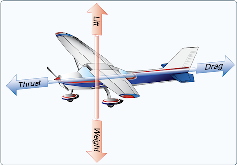

## Basic Aerodynamics and AC Components 
- Note: More detailed aerodynamic discussion in Chapter 5, this is just to set foundation to discuss components and construction

### Four Forces of Flight
- **Lift :** _The force that opposes the downward force of weight, is produced by the dynamic effect of the air acting on the wing, and acts perpendicular to the flight path through the wing’s center of lift (CL)._
- **Thrust :** _The forward force produced by the powerplant/propeller. It opposes or overcomes the force of drag. As a general rule, it is said to act parallel to the longitudinal axis (not always the case, but adequately illustrative)._
- **Drag :** _The rearward, retarding force that is caused by disruption of airflow by the wing, fuselage, and other protruding objects. Drag opposes thrust and acts rearward parallel to the relative wind._
- **Weight :** _The combined load of the aircraft itself, the crew, the fuel, and the cargo or baggage. Weight pulls the aircraft downward because of the force of gravity. It opposes lift and acts vertically downward through the aircraft’s center of gravity (CG)._

