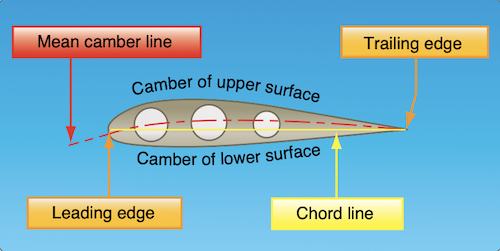

## Theories in the Production of Lift
- The most challenging obstacle to overcome in aviation, however, is the force of gravity. A wing moving through air generates the force called lift, which when greater than the force of gravity, directed opposite to the direction of gravity, enables an aircraft to fly.
- What we'll look at are the 2 areas of physics (Newton) and fluid dynamics (Bernoulli) that combine to produce the lift needed to keep an airplane in flight.

### Newton’s Basic Laws of Motion
- **First Law**: _“Every object persists in its state of rest or uniform motion in a straight line unless it is compelled to change that state by forces impressed on it.”_
- **Second Law**: _“Force is equal to the change in momentum per change in time. For a constant mass, force equals mass times acceleration.”_
- **Third Law**: _“For every action, there is an equal and opposite reaction.”_
- For our discussion of lift, all laws are at play, but the 3rd law comes into play more visibly than the others. the literal 'pushing' of the wing on the air and resultant push from the air onto the wing. 

### Bernoulli’s Principle of Differential Pressure
- Years after Newton, Bernoulli described how the pressure of a moving fluid (liquid or gas) varies with its speed of motion.
- **Bernoulli’s Principle**: States that _**as the velocity of a moving fluid (liquid or gas) <u>increases</u>, the pressure within the fluid <u>decreases</u>.**_ This principle explains what happens to air passing over the curved top of the airplane wing.
- A practical application of Bernoulli’s Principle is the _Venturi Tube_. The venturi tube has an air inlet that narrows to a throat (constricted point) and an outlet section that increases in diameter toward the rear. The diameter of the outlet is the same as that of the inlet. The mass of air entering the tube must exactly equal the mass exiting the tube. _**At the constriction, the speed must increase to allow the same amount of air to pass in the same amount of time as in all other parts of the tube. When the air speeds up, the pressure also decreases. Past the constriction, the airflow slows and the pressure increases.**_

### Airfoil Design
- When analyzing the wing itself, one of the first characteristics is that there is a difference in the curvatures (called cambers) of the upper and lower surfaces of the airfoil. The camber of the upper surface is more pronounced than that of the lower surface, which is usually somewhat flat.
- **Chord Line (and relation to Camber)**: The chord line is a reference line: _**A straight line drawn through the profile connecting the extremities of the leading and trailing edges.**_ The distance from this chord line to the upper and lower surfaces of the wing denotes the magnitude of the upper and lower camber at any point.
- **Mean Camber Line**: Another reference line _**drawn from the leading edege to the trailing edge, but that curves so as to remain equidistant from the upper and lower surfaces is the Mean Camber Line**_

